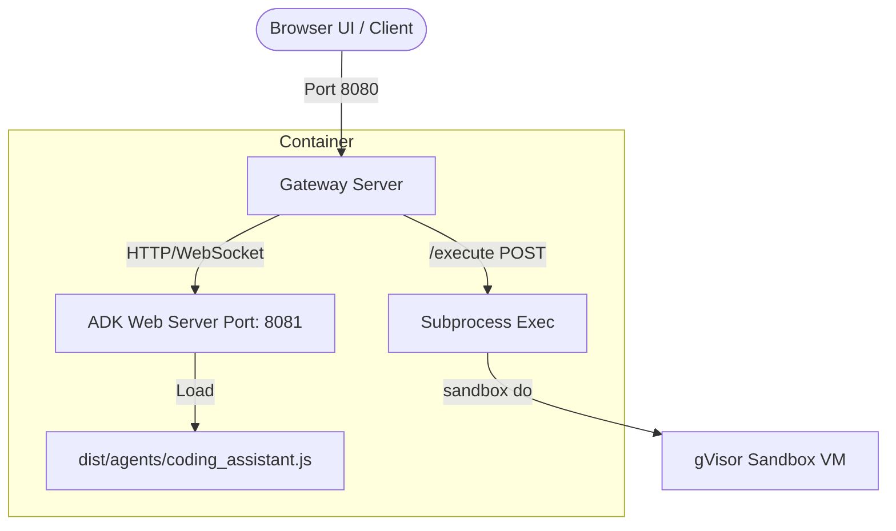

# Cloud Run Sandbox API

A service deployed on Google Cloud Run that executes untrusted code inside isolated gVisor sandboxed VMs. It provides both a POSIX Shell/Python REST API and an interactive ADK agent web interface.

## Features

*   **Isolated Execution:** Executes shell commands and Python scripts inside a nested gVisor microVM sandbox.
*   **REST API:** Direct HTTP `/execute` endpoint for scripting and automated clients.
*   **ADK Web UI:** Interactive web-based chat interface to interact with the agent.
*   **Token Authentication:** Optional Bearer token validation for HTTP and WebSocket connections.

## Architecture



For more details on security and filesystem containment, see the [Architecture Guide](docs/architecture_guide.md) and the [User Guide](docs/run-sandboxes-ug.md).

## Project Structure

*   `agents/coding_assistant.ts`: ADK agent definition.
*   `client/`: Workstation execution client.
*   `server.ts`: Ingress gateway, proxy, and `/execute` handler.
*   `Dockerfile`: Container image definition.

## Deployment

### 1. GCP Setup
Initialize environment variables and enable required APIs:

```bash
export PROJECT_ID="YOUR_GCP_PROJECT_ID"
export REGION="YOUR_GCP_REGION"

gcloud services enable --project=${PROJECT_ID} \
  run.googleapis.com \
  cloudbuild.googleapis.com \
  oslogin.googleapis.com
```

### 2. Build and Deploy
Submit the build to Cloud Build and deploy the service to Cloud Run with the second-generation (`gen2`) execution environment:

```bash
# Build container image
gcloud builds submit --tag gcr.io/${PROJECT_ID}/sandbox-assistant:latest --project=${PROJECT_ID}

# Deploy to Cloud Run
gcloud run deploy secure-coding-assistant \
  --image=gcr.io/${PROJECT_ID}/sandbox-assistant:latest \
  --region=${REGION} \
  --project=${PROJECT_ID} \
  --execution-environment=gen2 \
  --no-invoker-iam-check \
  --set-env-vars GOOGLE_GENAI_USE_VERTEXAI=1,GOOGLE_CLOUD_PROJECT=${PROJECT_ID},GOOGLE_CLOUD_LOCATION=${REGION}
```

## Token Authentication (Optional)

To secure the service, you can use an access token:

```bash
# Create a secret for your access token
gcloud secrets create api-auth-token --replication-policy="automatic"

export API_AUTH_TOKEN=$(openssl rand -hex 32)

echo -n "$API_AUTH_TOKEN" | gcloud secrets versions add api-auth-token --data-file=-

PROJECT_NUMBER=$(gcloud projects describe ${PROJECT_ID} --format="value(projectNumber)")

gcloud secrets add-iam-policy-binding api-auth-token \
 --member="serviceAccount:${PROJECT_NUMBER}-compute@developer.gserviceaccount.com" \
 --role="roles/secretmanager.secretAccessor" \
 --project=${PROJECT_ID}

gcloud run deploy secure-coding-assistant \
  --image=gcr.io/${PROJECT_ID}/sandbox-assistant:latest \
  --region=${REGION} \
  --project=${PROJECT_ID} \
  --execution-environment=gen2 \
  --no-invoker-iam-check \
  --set-env-vars GOOGLE_GENAI_USE_VERTEXAI=1,GOOGLE_CLOUD_PROJECT=${PROJECT_ID},GOOGLE_CLOUD_LOCATION=${REGION} \
  --set-secrets API_AUTH_TOKEN=api-auth-token:latest
```

### Using the Token

*   **Web UI:** Access the UI with the `token` query parameter:
    `http://localhost:9900/dev-ui/?app=coding_assistant&token=your-token`
    *Note: The gateway sets an `HttpOnly` cookie (`session_token`) upon first validation. Subsequent requests and WebSocket connections authorize automatically.*
*   **REST API Client:** Export the token in your workstation terminal. The client script automatically adds the `Authorization: Bearer <token>` header:
    `export API_AUTH_TOKEN="your-token"`

## Usage

### 1. Web UI
If you are behind a strict enterprise proxy, establish a local secure tunnel first:

```bash
gcloud alpha run services proxy secure-coding-assistant \
  --region=${REGION} \
  --project=${PROJECT_ID} \
  --port=9900
```

Then open the UI in your browser:
[http://localhost:9900/dev-ui/?app=coding_assistant](http://localhost:9900/dev-ui/?app=coding_assistant)

### 2. REST API (CLI Client)
Run the client script to execute code inside the cloud sandbox:

```bash
# Execute default script
npx tsx client/client.ts <SERVICE_URL>

# Execute a custom Python file
npx tsx client/client.ts <SERVICE_URL> client/example.py
```
