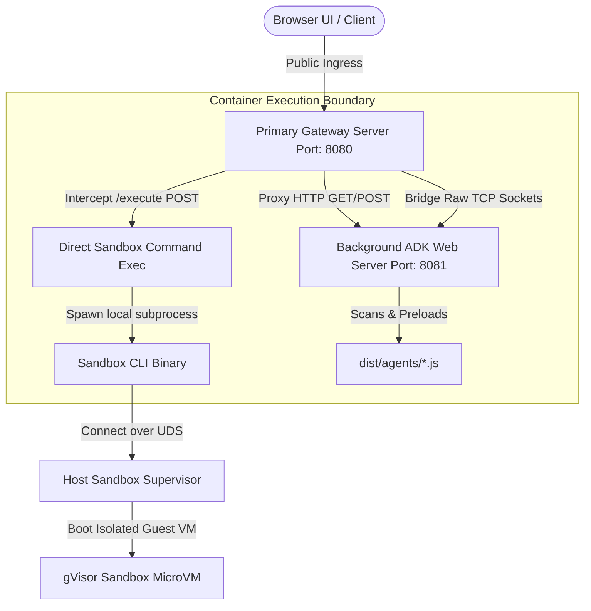

# Secure Serverless Sandbox: ADK Agent & Python REST API

An enterprise-grade, highly secure **ADK agent** and **POSIX Shell / Python execution endpoint** deployed on **Google Cloud Run**.

This platform showcases how to execute untrusted, LLM-generated code safely inside isolated, nested **gVisor hardware-virtualized sandbox VMs** natively in the cloud, completely unblocked by enterprise network perimeters.

---

## 🌟 Key Features

*   **⚡ Ephemeral gVisor VM Sandboxing:** Untrusted shell commands and Python scripts are executed inside a secure, second-layer, nested microVM sandbox in under **10 milliseconds**!
*   **🤖 Interactive Chatbot UI Dashboard:** Built-in interactive browser chat dashboard loading and serving our custom, robust `@google/adk` secure coding agent!
*   **🔌 Bare-Metal `/execute` REST API:** A direct, low-latency HTTP endpoint mapping execution to the local cloud sandbox natively, fully optimized for external CLI client scripts.
*   **🌉 High-Performance Network Gateway:** Custom primary routing gateway managing concurrent HTTP traffic and **tunneling WebSockets natively at the TCP socket layer**, completely bypassing public corporate proxy drops!
*   **🔑 OS Login & SSH-Enabled Container:** Fully SSHD and OS Login compliant container image supporting direct shell sessions inside your Cloud Run service via standard `gcloud alpha run services ssh`.

---

## 🗺️ Systems Architecture Blueprint



*For an in-depth dive into our security containment boundaries, empty PATH constraints, and base64 injection models, check out the [Core Systems Architecture Guide](docs/architecture_guide.md).*

---

## 📁 Repository Directory Structure

```yaml
cloud-run-sandbox-api/
├── agents/
│   └── coding_assistant.ts  # Standard ADK shell-sandboxing agent
├── client/
│   ├── client.ts            # User-friendly workstation execution client
│   └── example.py           # Sample python script template
├── docs/
│   └── architecture_guide.md# Core systems engineering documentation
├── server.ts                # Primary gateway proxy & direct REST API server
├── Dockerfile               # SSHD & Python3-enabled container deployment blueprint
├── package.json             # NPM dependencies & compilation scripts
├── tsconfig.json            # TypeScript modules compiler configurations
└── README.md                # Main developer manual
```

---

## ⚡ Quick Start: Deploy in 2 Minutes!

Follow these quick commands to build, push, and deploy the sandbox platform to your Google Cloud Project.

### 1. Prerequisites & GCP Setup
Initialize your target project and region locations:
```bash
export PROJECT_ID="YOUR_GCP_PROJECT_ID"
export REGION="YOUR_GCP_REGION" # e.g. us-west1
```

Enable the target serverless APIs inside your project:
```bash
gcloud services enable --project=${PROJECT_ID} \
  run.googleapis.com \
  cloudbuild.googleapis.com \
  oslogin.googleapis.com
```

### 2. Compile & Deploy the Container in the Cloud
Run Google Cloud Build to compile your TypeScript agent, install Python 3, configure OS Login keys, and package the Docker image:
```bash
gcloud builds submit --tag gcr.io/${PROJECT_ID}/sandbox-assistant:latest \
  --project=${PROJECT_ID}
```

Deploy the compiled image directly to Cloud Run, explicitly targeting the **Second Generation (`gen2`)** execution environment to activate the bind-mounted local sandbox socket:
```bash
gcloud run deploy secure-coding-assistant \
  --image=gcr.io/${PROJECT_ID}/sandbox-assistant:latest \
  --region=${REGION} \
  --project=${PROJECT_ID} \
  --execution-environment=gen2 \
  --no-invoker-iam-check \
  --set-env-vars GOOGLE_GENAI_USE_VERTEXAI=1,GOOGLE_CLOUD_PROJECT=${PROJECT_ID},GOOGLE_CLOUD_LOCATION=${REGION}
```

Once completed, the CLI will output your live **Service URL** (e.g. `https://secure-coding-assistant-xxxxxx.run.app`).

---

## 🔒 Securing your Sandbox with Token Authentication (Optional)

To secure both your REST API endpoints and the interactive chatbot browser UI against uninvited external users or dynamic billing hijacks, you can lock the container behind **Bearer Token Authentication**.

### Step 1: Deploy with an Access Token
Append the **`API_AUTH_TOKEN`** environment variable to your GCloud deployment configuration command block:
```bash
gcloud run deploy secure-coding-assistant \
  --image=gcr.io/${PROJECT_ID}/sandbox-assistant:latest \
  --region=${REGION} \
  --project=${PROJECT_ID} \
  --execution-environment=gen2 \
  --no-invoker-iam-check \
  --set-env-vars GOOGLE_GENAI_USE_VERTEXAI=1,GOOGLE_CLOUD_PROJECT=${PROJECT_ID},GOOGLE_CLOUD_LOCATION=${REGION},API_AUTH_TOKEN="your-secret-access-token"
```
*(Replace `your-secret-access-token` with a secure random key of your choice!).*

### Step 2: Unlocking the Chatbot UI (Browser)
If token auth is active, any unauthenticated browser hits are blocked instantly by the gateway with `401 Unauthorized`. 

To load and unlock the chatbot portal in your browser, simply append your secret token as a **URL query parameter**:
👉 **Locked Portal Entry URL:**
[http://localhost:9900/dev-ui/?app=coding_assistant&token=your-secret-access-token](http://localhost:9900/dev-ui/?app=coding_assistant&token=your-secret-access-token)

> [!NOTE]
> **Dynamic Session Cookies Handshaking:** The gateway router automatically registers a secure, HTTP-Only session cookie (`session_token`) inside your browser on your first validated load. All subsequent background AJAX operations and WebSocket dynamic streams authorize automatically behind-the-scenes. You only need to pass the token query in the address bar **exactly once**!

### Step 3: Unlocking the REST API (CLI Client Tool)
To authorize workstation-level client tool terminal executions, simply export the token in your active terminal shell session:
```bash
export API_AUTH_TOKEN="your-secret-access-token"
```
*The local `client.ts` script automatically discovers the exported token inside your system environment, and transparently injects the secure HTTP `Authorization: Bearer <token>` header to all outgoing requests!*

---

## 🤖 Launching the Interactive Chatbot UI

Because the browser dashboard uses WebSockets to stream AI responses in real-time, **workstations behind strict enterprise firewall or proxy blocks must route through a secure local proxy tunnel**.

*If you are browsing from a personal laptop, cellular device, or home internet, you can skip Step 1 and open the URL directly!*

### Step 1: Establish the Local Secure Proxy Tunnel
Run this command in a terminal tab on your workstation:
```bash
gcloud alpha run services proxy secure-coding-assistant \
  --region=YOUR_GCP_REGION \
  --project=YOUR_GCP_PROJECT_ID \
  --port=9900
```
*(This maps your workstation's local Port `9900` straight to the server container in the cloud, automatically authenticating connections using your active `gcert` credentials).*

### Step 2: Load your Agent in the Browser
Open your browser and navigate to your local tunnel port:
*   👉 **Launch the Chatbot Portal:**
    [http://localhost:9900/dev-ui/?app=coding_assistant](http://localhost:9900/dev-ui/?app=coding_assistant)

*The full interactive chatbot UI will load, and you can chat with the secure coding agent natively!*

---

## 🔌 Triggering Direct REST Executions (Workstation Client CLI)

If you want to bypass the browser UI completely and send scripts directly to the cloud sandbox from your command line:

### Step 1: Run the Client Script
Open a terminal on your workstation, navigate to the repo root, and run:
```bash
# Usage: npx tsx client/client.ts <SERVICE_URL> [PATH_TO_SCRIPT]
npx tsx client/client.ts https://secure-coding-assistant-YOUR_PROJECT_NUMBER.YOUR_REGION.run.app
```

### Step 2: Execute a Custom Python File
To execute a custom Python script (such as the template file we mapped at `client/example.py`):
```bash
npx tsx client/client.ts https://secure-coding-assistant-YOUR_PROJECT_NUMBER.YOUR_REGION.run.app client/example.py
```
*The client script transmits the Python payload, triggers the ephemeral VM run in under 10ms, compiles the code inside the secure gVisor Sandbox in the cloud, and prints stdout/stderr logs straight back to your console!*
