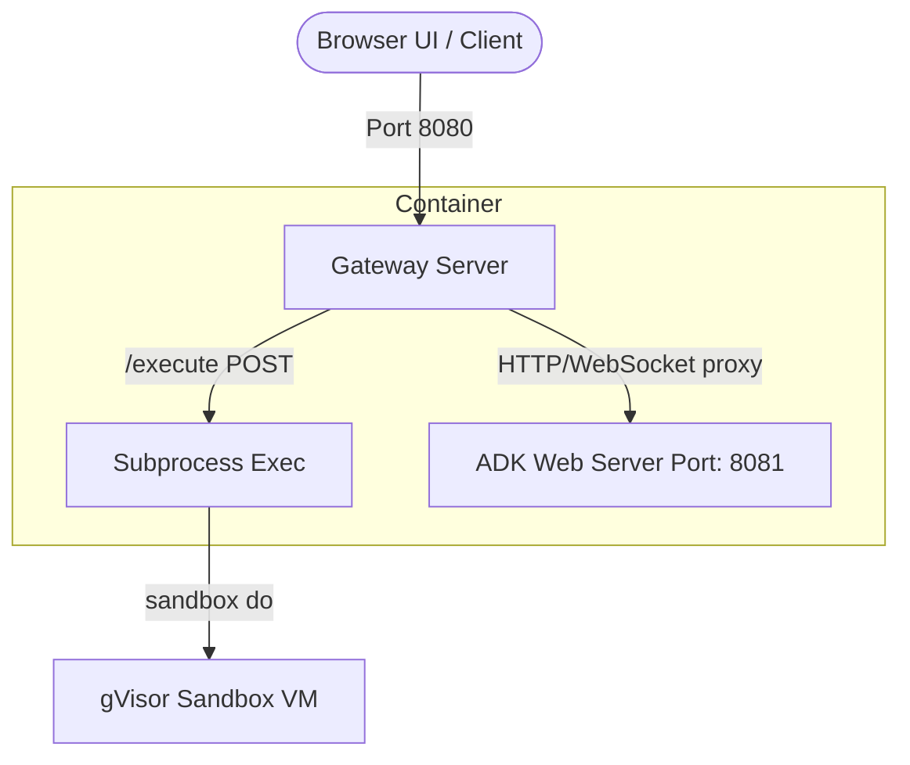

# Sandbox Systems Architecture Guide

This document outlines the system design, network routing, and security boundaries engineered for the Cloud Run Sandbox service.

---

## 1. Network Ingress and WebSocket Routing

Corporate proxies often block WebSocket connections (`wss://`) targeting default `*.run.app` domains. To bypass this, the gateway router (`server.ts`) intercepts WebSocket upgrade handshakes and proxies the TCP socket streams directly to the background ADK port.



### TCP Socket Piping
The gateway uses Node's native `net` module to pipe raw WebSocket TCP streams natively in memory to bypass proxy drops with minimal latency:

```typescript
server.on('upgrade', (req, socket, head) => {
  const client = net.connect(ADK_PORT, '127.0.0.1', () => {
    socket.pipe(client);
    client.pipe(socket);
  });
});
```

---

## 2. OS Login & SSH Compliance

Cloud Run SSH uses certificate-based authentication (OS Login) and injects a PAM daemon (`pam_oslogin.so`) on connection. Standard slim container images fail this handshake due to a missing shell or non-executable root shell mapping (`/usr/sbin/nologin`).

Our Dockerfile resolves this by:
1.  Installing statically compiled busybox commands under `/bin/`.
2.  Explicitly mapping the root user shell to a valid executable shell target at build time:
    ```dockerfile
    RUN sed -i '/^root:/c\root:x:0:0:root:/root:/bin/sh' /etc/passwd
    ```

---

## 3. Two-Layer Security Containment

To prevent LLM-generated code from exfiltrating project credentials, environment variables, or accessing metadata servers, a two-layer containment boundary is enforced:

1.  **Host Container:** Runs the Node.js gateway (Port 8080). It has access to environment variables and the sandbox manager CLI.
2.  **Nested Guest Sandbox VM:** An isolated gVisor virtual machine overlays the filesystem.
    *   **Zero Credential Visibility:** No access to host environment variables, directory structures, or metadata servers.
    *   **Network Isolation:** Completely internet-disabled (no egress).

```yaml
+-------------------------------------------------------------------------------+
|                       GOOGLE CLOUD RUN INSTANCE VM                            |
|                                                                               |
|   +-----------------------------------------------------------------------+   |
|   |                  HOST CONTAINER (PRIMARY SERVER)                      |   |
|   |                                                                       |   |
|   |   * Node.js gateway router (Port 8080)                                |   |
|   |   * Host Environment Variables & Service Account Keys                 |   |
|   |   * Sandbox CLI Binary: /usr/local/gcp/bin/sandbox                     |   |
|   |                                                                       |   |
|   |   +===============================================================+   |   |
|   |   ||                 NESTED GUEST gVISOR VM                      ||   |   |
|   |   ||                                                             ||   |   |
|   |   ||   * Isolated container filesystem overlay                    ||   |   |
|   |   ||   * Shell interpreter (/bin/sh) with empty PATH variable     ||   |   |
|   |   ||   * Python 3 interpreter (/usr/bin/python3)                 ||   |   |
|   |   ||   * ZERO internet access or metadata routing                ||   |   |
|   |   ||                                                             ||   |   |
|   |   +===============================================================+   |   |
|   +-----------------------------------------------------------------------+   |
+-------------------------------------------------------------------------------+
```

---

## 4. Base64 Command Injection

Piping code streams to stdin on nested virtual machines can cause hangs or EPIPE errors due to serverless pipeline constraints.

To avoid dynamic stdin pipelines, the host gateway base64-encodes the payload in memory and transmits it as a static argument parameter list:

1.  **Host-Side Encoding:**
    `Buffer.from(code).toString('base64')`
2.  **Guest-Side Execution:**
    `['do', '--', '/bin/sh', '-c', "echo '<base64>' | /usr/bin/base64 -d | /usr/bin/python3"]`

This removes open write descriptors and prevents connection hangs.

---

## 5. Empty PATH Constraints

The guest sandbox VM is initialized with a blank search path (`PATH []`) to prevent **PATH Hijacking / Binary Injection Attacks**. 

*   *Exploit Vector:* If a writable directory like `/tmp/` was ahead in the search path, a compromised script could write a malicious binary named `ls` to `/tmp/` and intercept subsequent system calls.
*   *Resolution:* By enforcing `PATH []`, all relative lookups are blocked. Every sub-process **must target its absolute path** (e.g., `/usr/bin/python3`, `/bin/sh`, `/bin/ls`).
